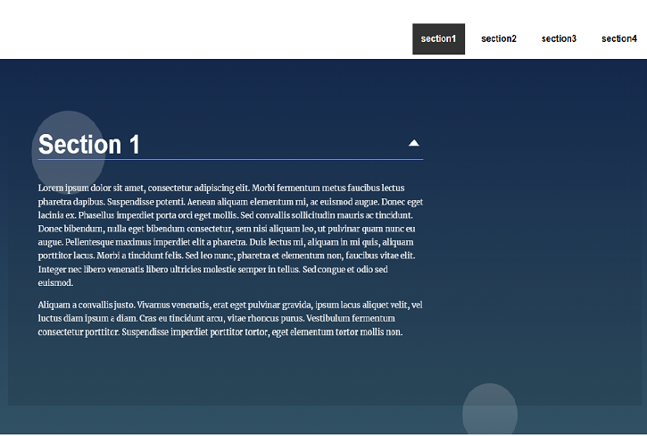

# Landing Page Project

## Table of Contents
- [Description](#description)
- [Setup](#setup)
- [Author Info](#author-info)

 ---

## Description
  The landing page is a project to manipulate the **DOM** and practice what you learn about the **DOM**
  
  
#### [Back To The Top](#landing-page-project)
 ----------- 

## Setup
 
1. Clone the project
2. Go to the project 
3. root directory
4. Run npm install
   

#### [Back To The Top](#landing-page-project)

 ----------- 

## Author Info
---
* Twitter  - [@sihamAnanzh](https://mobile.twitter.com)

* Instagram -[@Siham_ananzeh](https://mobile.twitter.com)

---

#### [Back To The Top](#landing-page-project)

